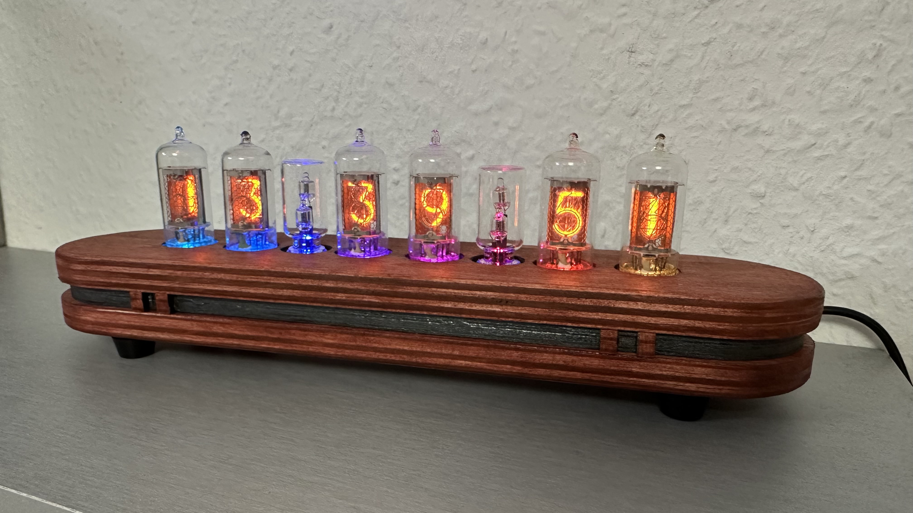

# EspNixieClock

EspNixieClock is an all in one WiFi Nixie NTP Clock firmware.

# Features

  - ESP8266 based (Arduino IDE code)
  - NTP Time syncronisation
  - Oled display and encoder to configure settings like timezone, auto DST, Neopixel backlight, auto shutdown between specific hours, etc.
  - Go over all numbers at specific time to avoid cathode poisoning (can be configured with the OLED display)
  - Neopixel backlight: rainbow, colorwheel, static color or disabled
  - showing the date on the tubes
  - Plug and play. Once you upload the code, a WiFi network will appear, connect to it following the instructions in the OLED display.

### To do

 - changing DST rule on the Display instead of commenting out lines in the code
 
### License

GNU Public License 3.0

### Photos
